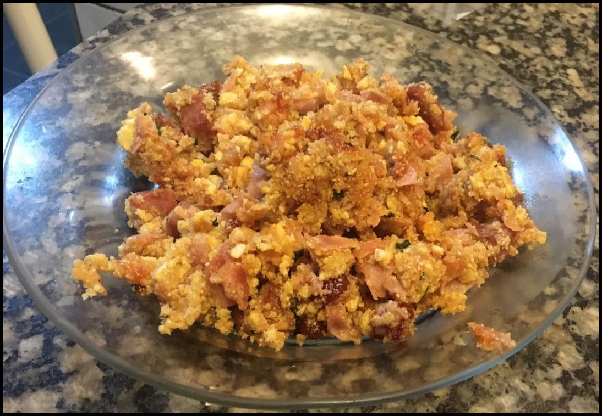

# Farofa Lampião e Julieta

Inventador: Vudu Reverso

## Ingredientes

* Meia calabresa, picada em cubos
* Bacon a gosto, picado em cubos
* 100 gramas de presunto, picado (melhor se for em cubos, mas presunto fatiado e picado também serve)
* Meia cebola picada (Não, não precisa picar a cebola em cubos)
* Pimentão a gosto, picado
* 4 ovos (não tente picar os ovos crus em cubos!)
* 100 gramas de mussarela, picada (melhor se for em cubos, mas mussarela fatiada e picada também serve)
* 150 gramas de goiabada, picada
* Farinha de mandioca a gosto

## Modo de preparo

* Numa panela, frite o bacon e a calabresa
* Adicione o presunto, misture e deixe dourar
* Adicione a cebola e o pimentão, misture e deixe fritar um pouco, enquanto mexe
* Adicione os 4 ovos e misture até os ovos começarem a ficar firmes
* Adicione a mussarela e a goiabada e mexa até a goiabada começar a derreter
* Adicione a farinha e misture

Coma até o bucho pedir arrego!